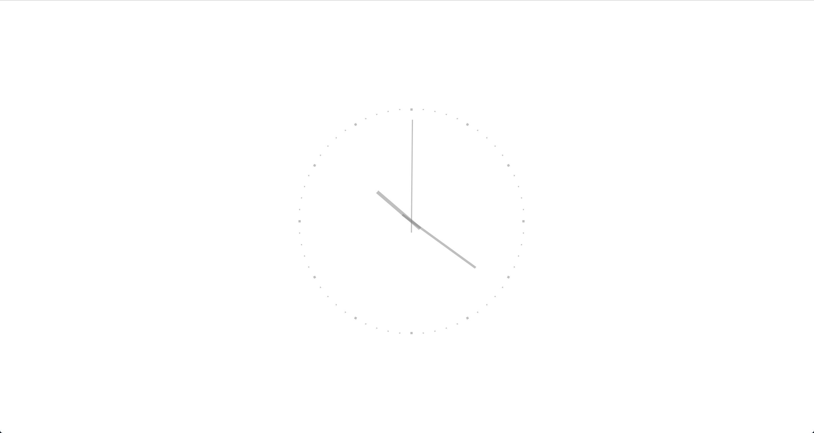
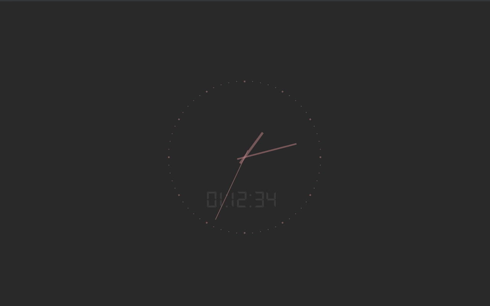
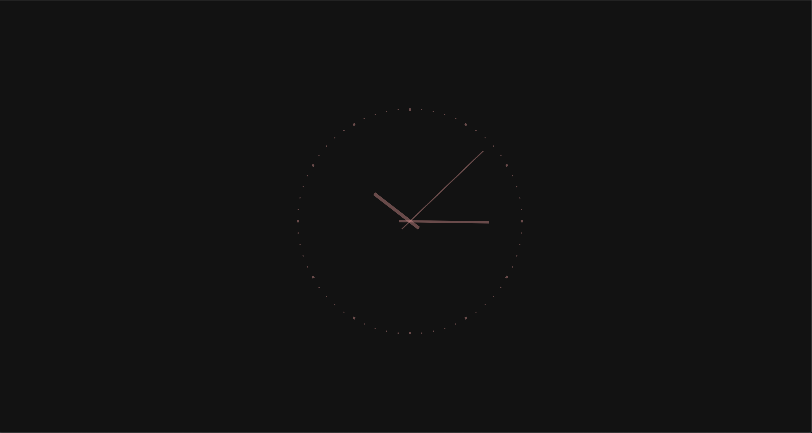
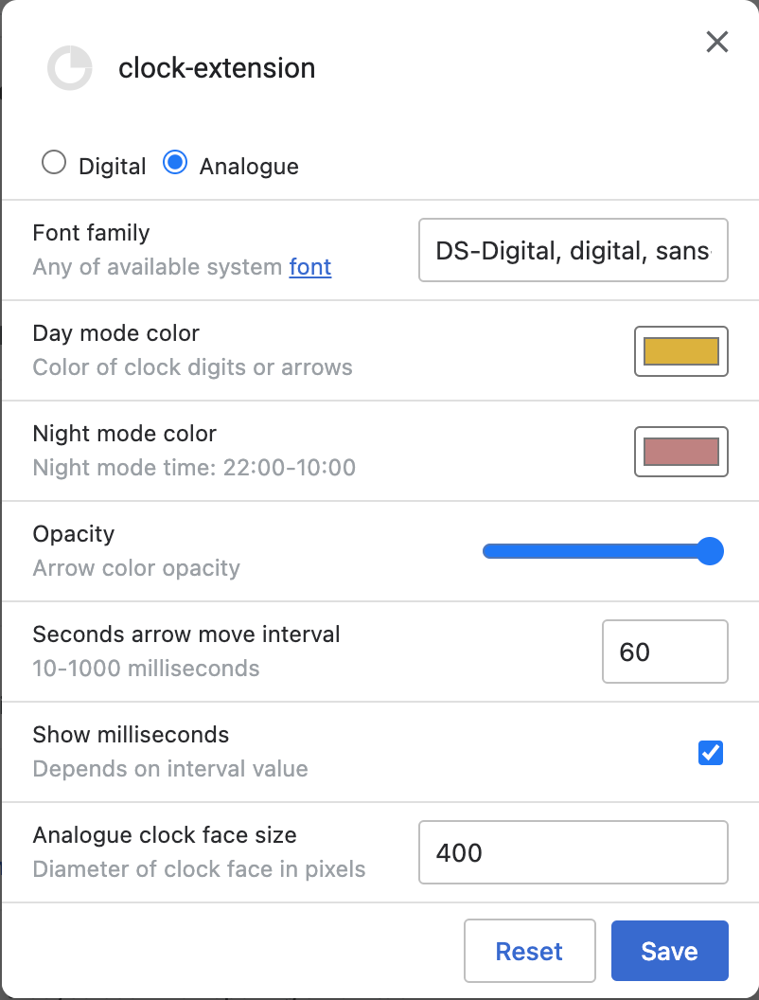

# Clock Extension

<b>Replaces the page that appears when the user creates a new tab or window with the analogue or digital clock. You can also get to this page by entering the URL [chrome://newtab]()</b>

**Day**

**Night**

**Dark theme**

**Options**

The goal of this project is to replace useless newtab page with something boring and not ordinary, because usually when I open new tab I immediately type in omnybox instead of search input at the middle of this page. This is much faster and omnibox has focus by default.
Another reason - when I share my screen, I do not want to accidentally show my recent page titles or screenshots of pages that I opened.

- Configurable night mode switch (22:00 - 10:00) 🌄
- Adopts to the system's dark/light theme switch 🌗
- No leaks [1](#b1)
- No ads
- Smooth clock arrow rotation
- Customizable interface
- Automatically paused when overlaps by other window or user switched to another tab [1](#b2)
- Automatically paused on idle

The [DS-Digital](https://www.dafont.com/ds-digital.font) font is used for digits

## Known Issues

> WARNING: High CPU usage
>
> Against the background of the fact, that browser cannot detect is window is active or not there is a risc that clock application will continue to run on minimized/background window and continue to overly use CPU/GPU for rendering.

So, I would not recommend to use this extension on laptop until there will be a better solution for this.

To minimize risk of battery drain, extension will be listen on Visibility API events and Idle events to stop superfluous calculations.

---
- 1 — Leak probability was minimized as far as possible [↩](#a1)
- 2 — [Page Visibility API](https://developer.mozilla.org/en-US/docs/Web/API/Page_Visibility_API) do not fully support occlusion by another window [Issue 715130](https://bugs.chromium.org/p/chromium/issues/detail?id=715130) [↩](#a2)